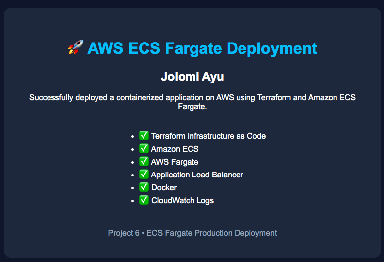
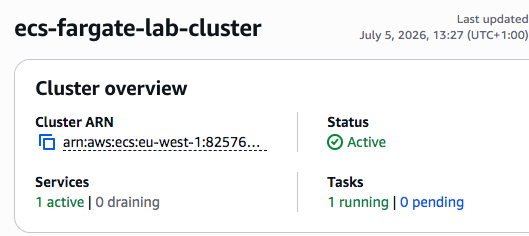
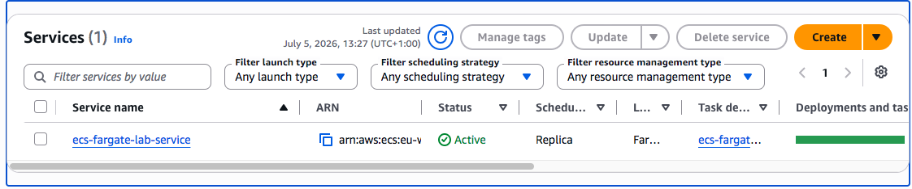
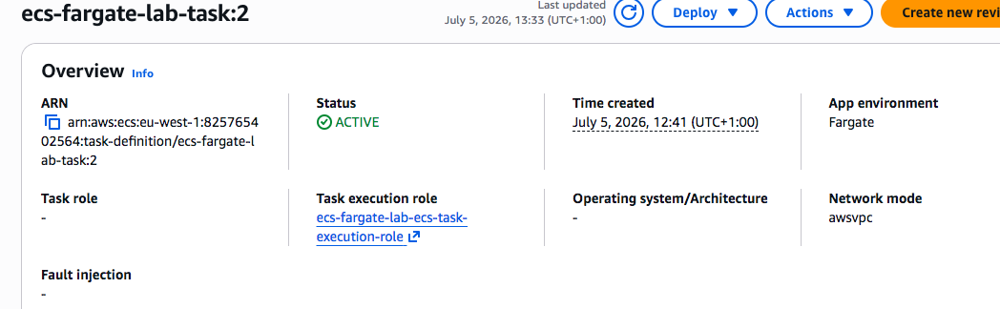
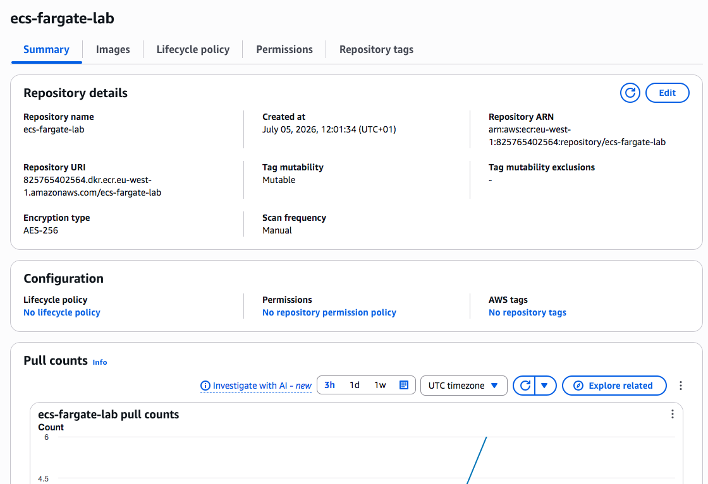
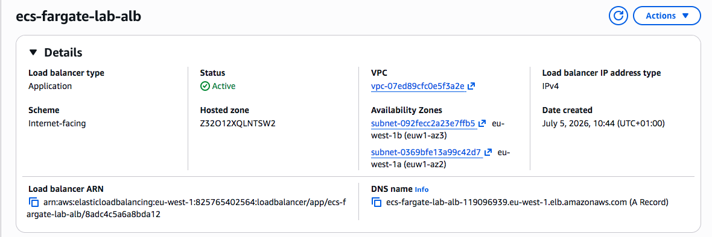
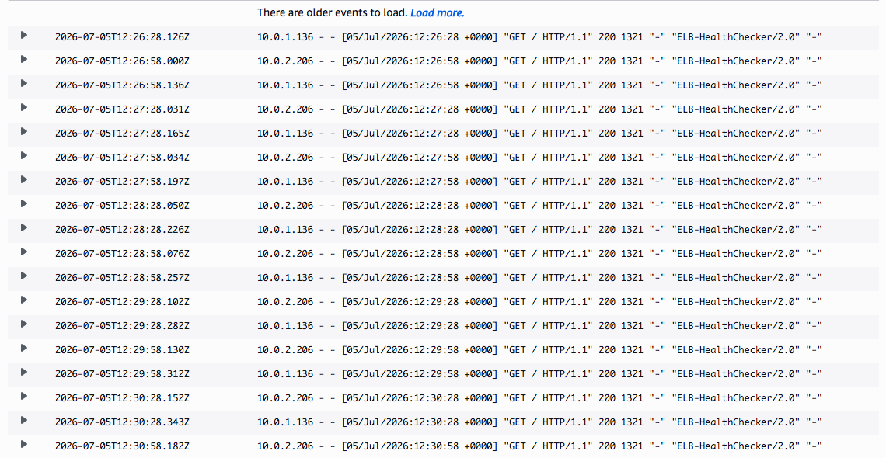

# AWS ECS Fargate Production Deployment

## 📖 Project Overview

This project demonstrates a production-style deployment of a custom Docker application on *Amazon ECS Fargate* using *Terraform. The application is stored in **Amazon ECR, deployed to **Amazon ECS, exposed through an **Application Load Balancer, and monitored with **CloudWatch Logs*.

---

## 🚀 Technologies Used

- Terraform
- Amazon ECS
- AWS Fargate
- Amazon ECR
- Docker
- Application Load Balancer (ALB)
- CloudWatch Logs
- IAM
- VPC
- Public Subnets
- Security Groups

---

## 🏗️ Architecture

Internet
     │
Application Load Balancer
     │
Target Group
     │
Amazon ECS Service
     │
AWS Fargate Task
     │
Custom Docker Container
     │
Amazon ECR

---

## 📂 Project Structure

ecs-fargate-lab/
│
├── docker/
│   ├── Dockerfile
│   └── index.html
│
├── terraform/
│   ├── provider.tf
│   ├── variables.tf
│   ├── main.tf
│   └── outputs.tf
│
└── screenshots/

---

## 📸 Screenshots

### Custom Landing Page

### ECS Cluster

### ECS Service

### Running Task

### Amazon ECR Repository

### Application Load Balancer

### CloudWatch Logs

---

## 🎯 Skills Demonstrated

- Infrastructure as Code with Terraform
- Docker containerization
- Amazon ECR image management
- Amazon ECS deployment
- AWS Fargate serverless containers
- Application Load Balancer configuration
- CloudWatch logging
- AWS networking (VPC, Subnets, Route Tables)
- IAM Roles and Permissions

---

## 📚 Key Learning Outcomes

- Built production-ready AWS infrastructure using Terraform.
- Created and deployed a custom Docker image.
- Stored container images in Amazon ECR.
- Deployed containers using Amazon ECS Fargate.
- Configured an Application Load Balancer.
- Verified application health and monitored logs using CloudWatch.

---

## 👨‍💻 Author

*Jolomi Ayu*

Cloud Engineer | AWS | Terraform | Docker | DevOps
